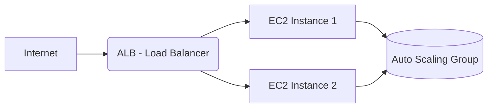

# 🚚 Lafarge Truck Traffic Management
*Infrastructure as Code (IaaS) | CI/CD | High Availability*

---

## 🏗️ Architecture Globale
Bienvenue sur le projet **Lafarge Truck Traffic**. Ce projet implémente une plateforme de gestion du trafic hautement disponible sur **AWS**, entièrement automatisée.

📂 Structure du Projet
Plaintext
.
├── 🚀 .github/workflows/  # Pipelines CI/CD automatisés
├── 📦 app/                # Application Python & Dockerfile
├── 🔧 Makefile            # Commandes rapides (Local)
├── 📊 monitoring/         # Stack Prometheus & Grafana
├── 🏗️ terraform/          # Infrastructure AWS (ALB, ASG, VPC)
└── 📄 README.md

⚡ Workflow CI/CD (GitHub Actions)
Chaque git push sur la branche main déclenche le pipeline suivant :

Étape,Action,Statut
Build,Création de l'image Docker,✅
Push,Publication sur Docker Hub,✅
Deploy,Mise à jour infra (Terraform),✅
Refresh,Déploiement sur AWS ASG,✅
Notify,Alerte Discord,🔔

🛠️ Comment travailler ?
1️⃣ Développement Local (Test)
Avant de déployer, validez vos changements :

make local-up : Lancer toute la stack en local.

make test : Exécuter les tests unitaires (pytest).

make local-clean : Nettoyer l'environnement.

2️⃣ Déploiement Cloud (Production)
Le déploiement est 100% automatisé. Pour déployer :

Modifiez votre code.

git commit -m "Votre message"

git push origin main

Vérifiez votre Discord : Vous recevrez une notification de succès ou d'échec en couleur ! 🟢/🔴

🔑 Prérequis (Secrets GitHub)
Pour que la magie opère, configurez ces variables dans Settings > Secrets > Actions :

🔑 AWS_ACCESS_KEY_ID & AWS_SECRET_ACCESS_KEY

🐳 DOCKERHUB_USERNAME & DOCKERHUB_TOKEN

💬 DISCORD_WEBHOOK

Projet réalisé avec passion par Lhassan Oubihi. 🚀
