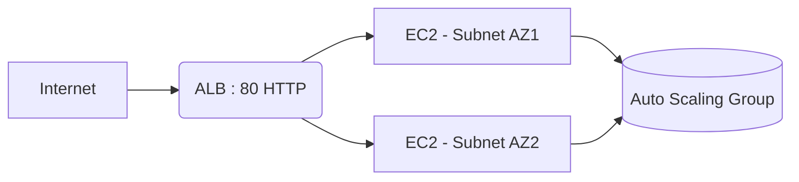

---

# 🚚 Lafarge Truck Traffic Management

*Infrastructure as Code (IaC) | CI/CD | High Availability*

Plateforme de gestion du trafic des camions, déployée de manière hautement disponible, automatisée et monitorée sur **AWS** — avec un mode 100% local pour valider le fonctionnement avant tout déploiement cloud.

---

## 🏗️ Architecture cible (AWS)



* **Load Balancing :** Application Load Balancer (ALB) sur 2 zones de disponibilité.
* **Scalabilité :** Auto Scaling Group (min=2 / max=4, target-tracking CPU 60%).
* **Monitoring :** Stack Prometheus + Alertmanager + Grafana (Instance dédiée).
* **State Terraform :** Stockage S3 (versionné + chiffré) avec verrouillage DynamoDB.

---

## 📂 Organisation des fichiers

```text
.
├── 🚀 .github/workflows/   # Pipelines CI/CD (GitHub Actions)
├── 📦 app/                 # Application Python + Dockerfile
├── 🔧 Makefile             # Commandes de gestion locale
├── 📊 monitoring/          # Stack Monitoring (Prometheus/Grafana)
├── 🏗️ terraform/           # Infrastructure as Code (AWS)
│   ├── bootstrap/          # Backend S3 + DynamoDB
│   └── main.tf             # Définition ALB, ASG, EC2
└── 📄 README.md            # Documentation

```

---

## ⚡ Workflow CI/CD (GitHub Actions)

Le pipeline est **100% automatisé**. Chaque `push` sur la branche `main` déclenche :

1. **Docker Job** : Build de l'image et publication sur Docker Hub.
2. **Deploy Job** :
* Exécution de `terraform apply` pour mettre à jour l'infrastructure.
* Lancement d'un `instance-refresh` sur l'ASG.


3. **Notification** : Confirmation du statut (Succès/Échec) envoyée en temps réel sur **Discord**.

---

## 🛠️ Guide d'utilisation

### 1. Développement Local (Mode Test)

Validez toute la chaîne d'observabilité avant le déploiement :

```bash
make local-up      # Lancer la stack complète
make test          # Exécuter les tests pytest
make local-clean   # Nettoyer les volumes et conteneurs

```

### 2. Déploiement AWS (Production)

Il n'est plus nécessaire d'exécuter `terraform` manuellement.

1. **Code :** Modifiez votre application ou votre infrastructure.
2. **Push :** `git push origin main`.
3. **Suivi :** Consultez l'onglet **Actions** sur GitHub et vérifiez votre canal **Discord**.

---

## 🔑 Prérequis (Secrets GitHub)

Configurez ces variables dans **Settings > Secrets and variables > Actions** :

* `AWS_ACCESS_KEY_ID` & `AWS_SECRET_ACCESS_KEY`
* `DOCKERHUB_USERNAME` & `DOCKERHUB_TOKEN`
* `DISCORD_WEBHOOK`

---

## 🚀 Points d'attention

* **Sécurité :** Restreindre `admin_cidr_ssh` à un bastion réel. Ne jamais exposer `0.0.0.0/0`.
* **Production :** Pour une mise en prod réelle, ajouter un certificat SSL (ACM) sur le port 443.
* **Secrets :** Déplacer les mots de passe sensibles (Grafana, Slack) vers AWS Secrets Manager.

---

*Projet développé pour le cycle ingénieur — **ENSA Meknès*** 🎓
