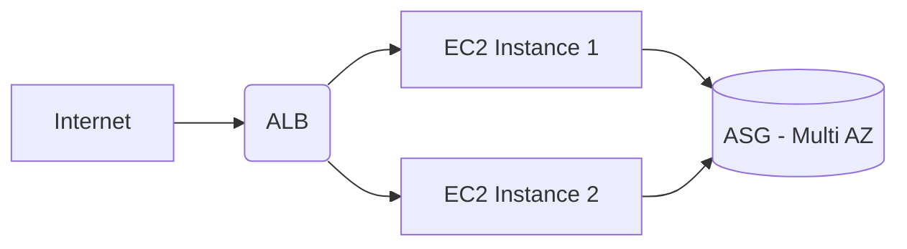

```markdown
# 🚚 Lafarge Truck Traffic Management
*Infrastructure as Code (IaC) | CI/CD | High Availability*

Plateforme de gestion du trafic des camions, déployée de manière hautement disponible sur **AWS** et entièrement pilotable en **local**.

---

## 🏗️ Architecture du Projet
L'application est conteneurisée et déployée sur un **Auto Scaling Group (ASG)** derrière un **Application Load Balancer (ALB)**.



---

## 📂 Organisation des fichiers

```text
.
├── 🚀 .github/workflows/  # Pipeline CI/CD (GitHub Actions)
├── 📦 app/                # Application Python & Dockerfile
├── 🔧 Makefile            # Commandes de gestion locale & cloud
├── 📊 monitoring/         # Stack Prometheus & Grafana
├── 🏗️ terraform/          # Infrastructure AWS (ALB, ASG, VPC)
└── 📄 README.md           # Documentation

```

---

## ⚡ Workflow CI/CD (GitHub Actions)

Le déploiement est **100% automatisé**. Chaque `push` sur la branche `main` exécute :

| Étape | Action | Statut |
| --- | --- | --- |
| **Build** | Création image Docker | ✅ |
| **Push** | Publication Docker Hub | ✅ |
| **Terraform** | Mise à jour infra AWS | ✅ |
| **Refresh** | Déploiement sur ASG | ✅ |
| **Notify** | Alerte Discord | 🔔 |

---

## 🛠️ Guide d'utilisation avec `make`

Pour simplifier votre quotidien, nous utilisons un `Makefile`. Voici les commandes disponibles :

### 🖥️ Développement Local

* `make local-up` : Lance la stack complète (App + Monitoring).
* `make local-down` : Arrête la stack sans supprimer les données.
* `make local-clean` : Arrête tout et supprime les volumes (Reset complet).
* `make app-test` : Simulation d'entrée de camion pour valider les métriques.
* `make test` : Exécute les tests unitaires avec `pytest`.

### 🏗️ Infrastructure & AWS

* `make tf-init` : Initialise Terraform avec le backend S3.
* `make tf-plan` : Prévisualise les changements sur AWS.
* `make tf-apply` : Applique les changements d'infrastructure.
* `make aws-refresh` : Force l'Auto Scaling Group à déployer la dernière image Docker.

*(Tapez `make help` dans votre terminal pour voir la liste complète des commandes).*

---

## 🔑 Configuration (Secrets GitHub)

Pour activer le déploiement automatique, configurez ces variables dans **Settings > Secrets > Actions** :

* `AWS_ACCESS_KEY_ID` & `AWS_SECRET_ACCESS_KEY`
* `DOCKERHUB_USERNAME` & `DOCKERHUB_TOKEN`
* `DISCORD_WEBHOOK`

---

