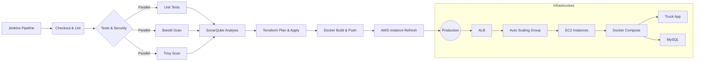

# 🚚 Lafarge Truck Traffic Management System

[](https://sonarcloud.io/summary/new_code?id=lhassan-oubihi-eng_lafarge-truck-traffic)
[](https://sonarcloud.io/summary/new_code?id=lhassan-oubihi-eng_lafarge-truck-traffic)

A high-availability, fully automated, and secured DevOps-driven system designed to streamline and monitor truck traffic for Lafarge industrial sites.

---

## 🏗️ CI/CD Pipeline Architecture
Our pipeline ensures rapid and safe deployments using parallel execution and automated infrastructure refreshing:



---

## 🌟 Key Features

* **FastAPI Backend**: Real-time API tracking with responsive UI/HTML dashboards.
* **100% Test Coverage**: Verified robustly via test suites.
* **Security First**: Dependency locking using secure SHA hashes, Bandit/Trivy scans, and dynamic SonarCloud alignment.
* **Multi-Stage Docker**: Ultra-lightweight, production-grade containerization.
* **Infrastructure as Code**: AWS cloud architecture (VPC, ALB, ASG, EC2) provisioned via modular Terraform.
* **Optimized CI/CD**: Jenkins pipeline with parallel stages and automated rolling updates (Instance Refresh).
* **Observability**: Live monitoring infrastructure with Prometheus, Grafana, and Node Exporter.
* **Dynamic Versioning**: Automated image tagging using `GIT_HASH` and `BUILD_NUMBER` for reliable deployments.

---

## 🛠️ Technology Stack

* **Backend**: Python 3.12, FastAPI, Uvicorn
* **CI/CD**: Jenkins, SonarCloud, GNU Makefile
* **Infrastructure**: AWS, Terraform
* **Containerization**: Docker, Docker Compose (Service-level orchestration)
* **Monitoring**: Prometheus, Grafana, Alertmanager
* **Security**: Bandit, Trivy, Pre-commit hooks

---

## 🚀 How to Run the Project (via Makefile)

We use an automated `Makefile` as the single source of truth for all development, infrastructure, and deployment tasks.

### 1. Local Stack Orchestration

```bash
# Clean previous environments, build and run the local stack
make local-up

```

### 2. Development & Testing

```bash
# Run unit tests
make test

# Full clean (Stop containers + remove volumes)
make local-clean

```

### 3. AWS Infrastructure Deployment

```bash
# Provision core AWS infra
make tf-init
make tf-apply-force

# Build and push new Docker image
make docker-push-hash

# Trigger zero-downtime rolling update on AWS
make aws-refresh

```

---

## 🌐 API Directory & Endpoints

| Endpoint | Method | Description | Target Consumer |
| --- | --- | --- | --- |
| `/` | GET | Main responsive traffic dashboard | Operations Staff |
| `/api/trucks` | GET | Collection of active trucks | Client App / UI |
| `/metrics` | GET | Telemetry data | Prometheus Scraper |
| `/healthz` | GET | Service health-check | AWS Load Balancer |

---

## 👥 Project Contributors & Supervision

* **Fait par**: Lhassan OUBIHI & Taha HADDAD
* **Encadrant**: Mr. SAAD FOUTOUHI
* **Academic Year**: 2025-2026

```
